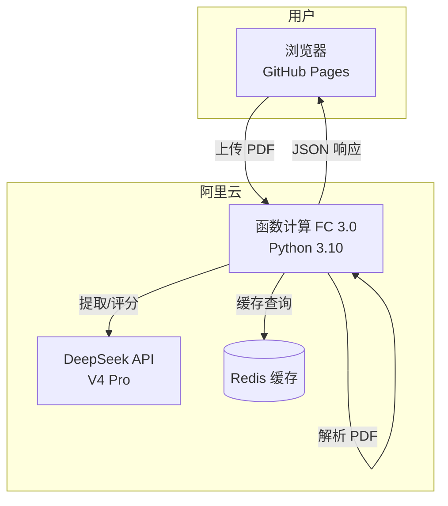

# AI Resume Analysis System

基于 **FastAPI + DeepSeek V4 Pro** 的智能简历分析系统，支持 PDF 简历解析、AI 信息提取、岗位匹配度评分与改进建议。采用**阿里云函数计算 FC 3.0** 部署后端，**GitHub Pages** 托管前端。

## 在线演示

| 资源 | 地址 |
|------|------|
| 前端页面 | https://crs2006220-gif.github.io/ai-resume-analyzer/ |
| 后端 API | https://ai-resuanalyzer-hhmxrvfegx.cn-hangzhou.fcapp.run |
| API 文档 (Swagger) | https://ai-resuanalyzer-hhmxrvfegx.cn-hangzhou.fcapp.run/docs |
| 源代码 | https://github.com/crs2006220-gif/ai-resume-analyzer |

## 功能特性

- **PDF 简历解析** — 基于 PyMuPDF 提取简历文本，支持中英文混排
- **AI 信息提取** — 通过 DeepSeek V4 Pro 结构化提取姓名、联系方式、教育/工作经历、技能
- **四维匹配评分** — 综合能力、岗位匹配度、简历结构、内容质量的量化评估
- **优劣势分析** — 自动识别简历强项与薄弱环节
- **个性化改进建议** — 针对目标岗位生成可操作的优化方案
- **Redis 智能缓存** — 相同简历重复上传秒级返回，TTL 1 小时
- **SSE 流式进度** — 实时展示三阶段处理进度（解析 → 提取 → 评分）
- **优雅降级** — Redis 不可用时自动跳过缓存，系统正常运行

## 技术栈

### 后端

| 技术 | 用途 |
|------|------|
| FastAPI 0.115 | 高性能异步 Web 框架 |
| Uvicorn 0.34 | ASGI 服务器 |
| DeepSeek V4 Pro | AI 大模型（简历提取 + 匹配评分） |
| PyMuPDF 1.25 | PDF 文本解析 |
| Redis 5.2 | 分析结果缓存 |
| Pydantic 2.10 | 数据校验与配置管理 |
| 阿里云 FC 3.0 | Serverless 部署 |

### 前端

| 技术 | 用途 |
|------|------|
| Vue 3 (CDN) | 响应式 UI 框架 |
| Element Plus (CDN) | 企业级 UI 组件库 |
| 渐进式进度条 | 三阶段平滑动画（15%→90%→100%） |

## 架构图



## 项目结构

```
ai-resume-analyzer/
├── app/
│   ├── main.py              # FastAPI 应用入口 + CORS 配置
│   ├── config.py             # Pydantic Settings 环境变量配置
│   ├── models/
│   │   └── resume.py         # Pydantic 数据模型
│   ├── routers/
│   │   ├── resume.py         # 简历上传/解析/SSE 路由
│   │   └── matching.py       # 匹配度评分路由
│   ├── services/
│   │   ├── pdf_parser.py     # PyMuPDF 文本提取
│   │   ├── ai_extractor.py   # DeepSeek 简历信息提取
│   │   └── matcher.py        # DeepSeek 匹配度分析
│   └── utils/
│       ├── redis_client.py   # Redis 连接管理（优雅降级）
│       └── cache.py          # 缓存读写工具
├── static/
│   └── index.html            # Vue3 + Element Plus 前端
├── code/                     # FC 3.0 部署包（含 vendored 依赖）
│   └── server.py             # FC 事件 → ASGI 适配器
├── s.yaml                    # Serverless Devs FC 3.0 配置
├── index.html                # GitHub Pages 入口
├── requirements.txt
└── .env                      # 环境变量（本地开发）
```

## 快速开始

### 环境要求

- Python 3.10+
- Redis 6.0+（可选，禁用缓存仍可运行）
- Windows / Linux / macOS

### 本地运行

```bash
# 1. 克隆仓库
git clone https://github.com/crs2006220-gif/ai-resume-analyzer.git
cd ai-resume-analyzer

# 2. 安装依赖
pip install -r requirements.txt

# 3. 配置环境变量
cp .env.example .env
# 编辑 .env，填入 DeepSeek API Key

# 4. 启动 Redis（可选）
# Windows 用户可通过 WSL: wsl redis-server
# 或跳过，系统会自动禁用缓存模式

# 5. 启动服务
uvicorn app.main:app --reload --host 0.0.0.0 --port 8000

# 6. 访问
# 前端: http://localhost:8000
# API 文档: http://localhost:8000/docs
```

## 部署说明

### 后端：阿里云 FC 3.0

```bash
# 安装 Serverless Devs
npm install -g @serverless-devs/s

# 部署
s deploy --assume-yes
```

配置文件 `s.yaml` 中已包含函数计算配置。首次部署前需在阿里云控制台配置 AccessKey。

### 前端：GitHub Pages

1. 将 `index.html` 推送至 GitHub 仓库根目录
2. Settings → Pages → Source: `Deploy from a branch` → `master` → `/ (root)` → Save
3. 访问 `https://<username>.github.io/ai-resume-analyzer/`

## API 文档

### 主要端点

| 方法 | 路径 | 说明 |
|------|------|------|
| GET | `/health` | 健康检查 |
| GET | `/api/v1/health` | API 版本健康检查 |
| POST | `/api/v1/resume/upload` | 上传 PDF + 岗位，返回完整分析 |
| POST | `/api/v1/resume/upload/stream` | SSE 流式上传与分析 |
| POST | `/api/v1/resume/parse` | 仅解析简历，不评分 |

完整 API 文档请访问：https://ai-resuanalyzer-hhmxrvfegx.cn-hangzhou.fcapp.run/docs

### 示例请求

```bash
curl -X POST \
  -F "file=@resume.pdf" \
  -F "position=Python 后端工程师" \
  https://ai-resuanalyzer-hhmxrvfegx.cn-hangzhou.fcapp.run/api/v1/resume/upload
```

### 响应示例

```json
{
  "resume_info": {
    "name": "张三",
    "email": "zhangsan@example.com",
    "phone": "13800138000",
    "education": [{"school": "清华大学", "degree": "硕士", "major": "计算机科学"}],
    "work_experience": [{"company": "字节跳动", "position": "后端开发", "duration": "2021-2024"}],
    "skills": ["Python", "Go", "Kubernetes", "MySQL"]
  },
  "scores": {
    "overall": 82,
    "position_match": 78,
    "structure": 85,
    "content_quality": 80
  },
  "strengths": ["技术栈匹配度较高", "有大厂工作经验"],
  "weaknesses": ["缺少项目量化成果", "技能描述不够具体"],
  "suggestions": ["建议在每段经历中添加量化的业务成果", "技能部分按熟练度分级展示"],
  "summary": "整体简历质量良好，与 Python 后端工程师岗位匹配度较高..."
}
```

## 技术亮点

### Redis 优雅降级

缓存服务不可用时自动跳过，不影响核心功能。连接失败后标记为不可用，避免重复重试。

### Serverless 架构

基于阿里云 FC 3.0 按需计费，无请求时不产生费用。冷启动时间 < 3s，支持自动弹性伸缩。

### 三阶段模拟进度

前端采用减速算法模拟进度条：15% 快速到达 → 90% 减速渐进 → 100% 分析完成，避免生硬跳变。

## 许可证

MIT License
